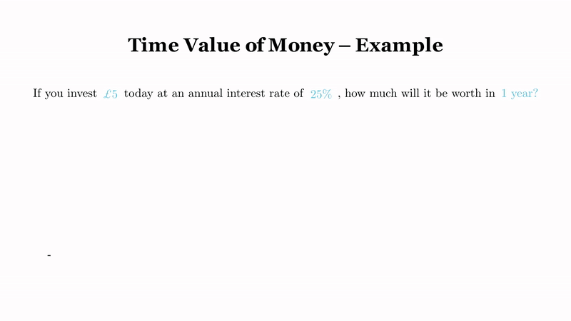
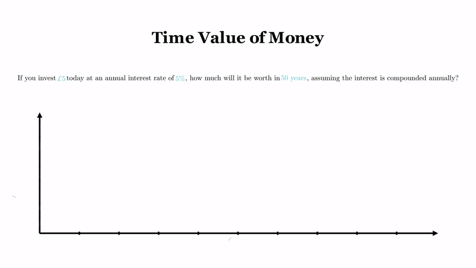

# 💸 Time Value of Money – Manim Animation

This animation visually explains a fundamental question in finance:  
**How much is £5 worth after one year at 25% interest?**  
**How much is £5 worth after fifty years at 5% interest?**

---

## 📘 Scenario Explained

> **Questions:**  
> If you invest **£5** today at an **annual interest rate of 25%**, how much will it be worth in **1 year**?  
> If you invest **£5** today at an **annual interest rate of 5%**, how much will it be worth in **50 years**?

These Manim animations include:  
- Timeline from Year 0 to Year 1  
- A £5 banknote transforming into £6.25  
- A 25% interest "coin" added to the note  
- A 5% compounded interest example  
- A summary transformation  

---

## 🧰 Built With

- 🧮 [Manim Community Edition](https://docs.manim.community/en/stable/)  
- 🎞️ Rendered in 1920×1080 at 60 fps  
- 📚 Jupyter Notebook with `%manim` cell rendering  

---

## 🎥 Animation 1 Preview

---

## 🎥 Animation 2 Preview

---

## 👤 Author

**Said Kaawach**  
Lecturer in Economics and Finance  
University of Huddersfield

---

## 🙏 Acknowledgements

This animation script was inspired by the excellent work of [@dipes08](https://github.com/dipes08).  
His contributions to Manim-based finance visualizations served as a key reference for this project.
